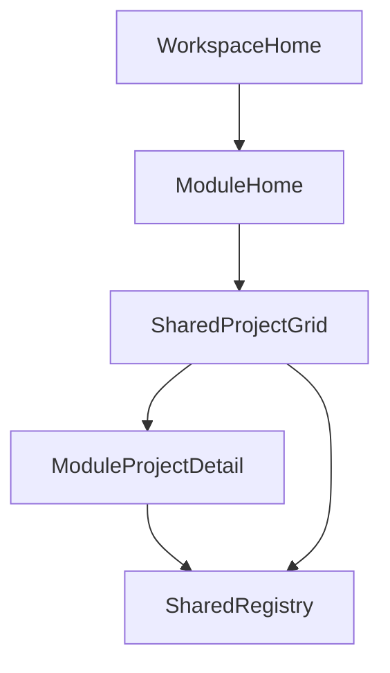

# SpecForge Workspace Evolution Plan

## Current Architecture Review

- App is currently a 2-route viewer (`/`, `/project/:projectId`) defined in [C:/Users/subbu/Desktop/spec-forge/apps/spec-viewer/src/router.tsx](C:/Users/subbu/Desktop/spec-forge/apps/spec-viewer/src/router.tsx).
- Shared project source is already filesystem-first via Vite globs in:
  - [C:/Users/subbu/Desktop/spec-forge/apps/spec-viewer/src/data/projects.ts](C:/Users/subbu/Desktop/spec-forge/apps/spec-viewer/src/data/projects.ts)
  - [C:/Users/subbu/Desktop/spec-forge/apps/spec-viewer/src/content/specs.ts](C:/Users/subbu/Desktop/spec-forge/apps/spec-viewer/src/content/specs.ts)
- Current coupling risks:
  - duplicate path parsing logic across two files
  - module behavior concentrated in one `ProjectPage`
  - no explicit module shell/navigation model

## Updated Folder Structure (Proposed)

- Keep existing app, evolve it as workspace shell:
  - `src/app/` → app-level shell + route config
  - `src/workspace/` → shared module-agnostic building blocks
    - `registry/` (single project registry + markdown lookup)
    - `layout/` (workspace frame, module header, project grid)
    - `components/` (shared cards, status pills, metadata blocks)
    - `types/` (shared project/module contracts)
  - `src/modules/` → module-specific views only
    - `idea-validator/`
    - `spec-viewer/`
    - `design-tokens/`
    - `poc-builder/`

## Shared Registry Strategy (Single Source of Truth)

- Build one centralized registry module that all modules consume.
- Consolidate current `projects.ts` + `specs.ts` into one source:
  - normalized path parsing (Windows-safe)
  - metadata ingestion from `projects/*/metadata.json`
  - spec manifest derivation from `projects/*/specs/*.md`
  - markdown lookup keyed by `${projectId}/${specSlug}`
- Keep runtime filesystem-first (no backend/db), optionally add lightweight runtime validation warnings (non-blocking) for missing/invalid project files.

### Shared Registry Data Contract

- `ProjectMetadata`: existing fields (`id,title,description,status,tags,updatedAt,readiness`)
- `ProjectRegistryEntry`: `metadata + specs[] + derived helpers`
- `ModuleProjectView`: per-module projection computed from same entry (no duplicated registries)

## Navigation Architecture

- Replace current root-only flow with workspace + modules:
  - `/` → workspace home (module selector)
  - `/idea-validator` and `/idea-validator/:projectId`
  - `/spec-viewer` and `/spec-viewer/:projectId`
  - `/design-tokens` and `/design-tokens/:projectId`
  - `/poc-builder` and `/poc-builder/:projectId`
- Every module home shows project grid from shared registry.
- Every module detail reads same project data, then renders module-specific slices.

## Layout Strategy

- Introduce a consistent workspace frame:
  - top workspace header (title + module tabs)
  - module-level subheader (module purpose text)
  - shared project grid/list container
  - module detail two-pane pattern where needed
- Keep monochrome-first UI:
  - grayscale surfaces as default
  - semantic accents only for status/readiness/highlight states
- Reuse existing shadcn primitives; do not introduce global state framework.

## Reusable Workspace Components

- `WorkspaceShell` (global frame)
- `ModuleNav` (module switching)
- `ProjectGrid` + `ProjectCard`
- `ProjectMetaPanel` (status/readiness/tags/updated date)
- `MarkdownPane` (preview/raw toggle + internal scroll behavior)
- `SpecListSidebar` (reused by spec-viewer, optionally poc/design modules)

## Module-Specific vs Shared Boundaries

- Shared:
  - filesystem registry loading/parsing
  - project metadata/spec manifest/types
  - route shell + navigation
  - cards, badges, markdown renderer, layout primitives
- Module-specific:
  - Idea Validator: readiness/risk/open-question summary composition
  - Spec Viewer: full spec sidebar + markdown browsing
  - Design Token Generator: views over `04-design-tokens.md` sections only
  - POC Builder: views over `08-poc-brief.md` sections only

## Incremental Implementation Sequence (After Approval)

- Phase 1: extract shared registry and keep current spec-viewer behavior unchanged.
- Phase 2: add workspace home + module routes + module homes using same project grid.
- Phase 3: split `ProjectPage` into module-specific detail pages with shared layout primitives.
- Phase 4: add module-specific projections (idea summary, token summary, poc summary) from existing markdown/spec files.
- Phase 5: visual consistency pass (monochrome + semantic accents) and route regression checks.

## Key Constraints Preserved

- No backend, auth, db, cloud sync, Redux, CMS/editor, drag/drop.
- Local-first + filesystem-first + markdown-first architecture remains unchanged.
- Modules are views over one shared project source, not separate applications.
